# Autonomous Data Scientist — Software Architecture

> **Version:** 1.0.0  
> **Date:** July 13, 2026  
> **Architect:** Senior Software Architect  
> **Status:** Approved for Implementation

---

## Table of Contents

1. [High-Level Architecture](#1-high-level-architecture)
2. [Component Diagram](#2-component-diagram)
3. [Agent Architecture](#3-agent-architecture)
4. [LangGraph Architecture](#4-langgraph-architecture)
5. [API Architecture](#5-api-architecture)
6. [Database Architecture](#6-database-architecture)
7. [Deployment Architecture](#7-deployment-architecture)
8. [Sequence Diagram](#8-sequence-diagram)
9. [Data Flow Diagram](#9-data-flow-diagram)
10. [Folder Structure](#10-folder-structure)

---

## 1. High-Level Architecture

The Autonomous Data Scientist (ADS) is a multi-agent AI platform that ingests raw data, autonomously plans analytical workflows, executes Python-based data science pipelines, interprets results, and delivers actionable insights — all with minimal human intervention.

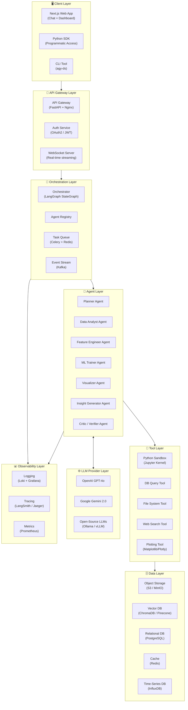

---

## 2. Component Diagram

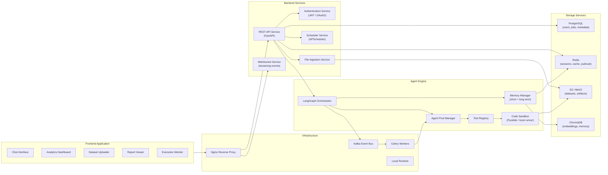

---

## 3. Agent Architecture

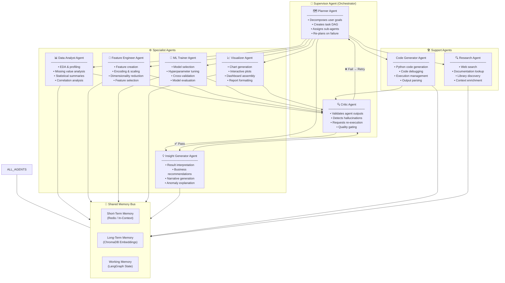

---

## 4. LangGraph Architecture

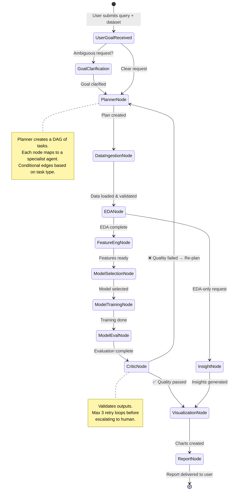

### LangGraph State Schema

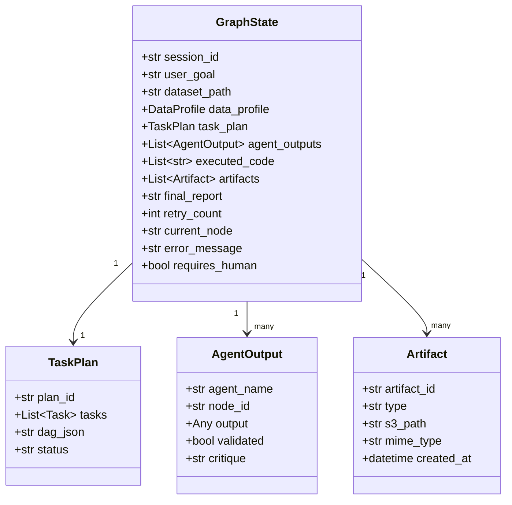

---

## 5. API Architecture

### REST API Endpoints

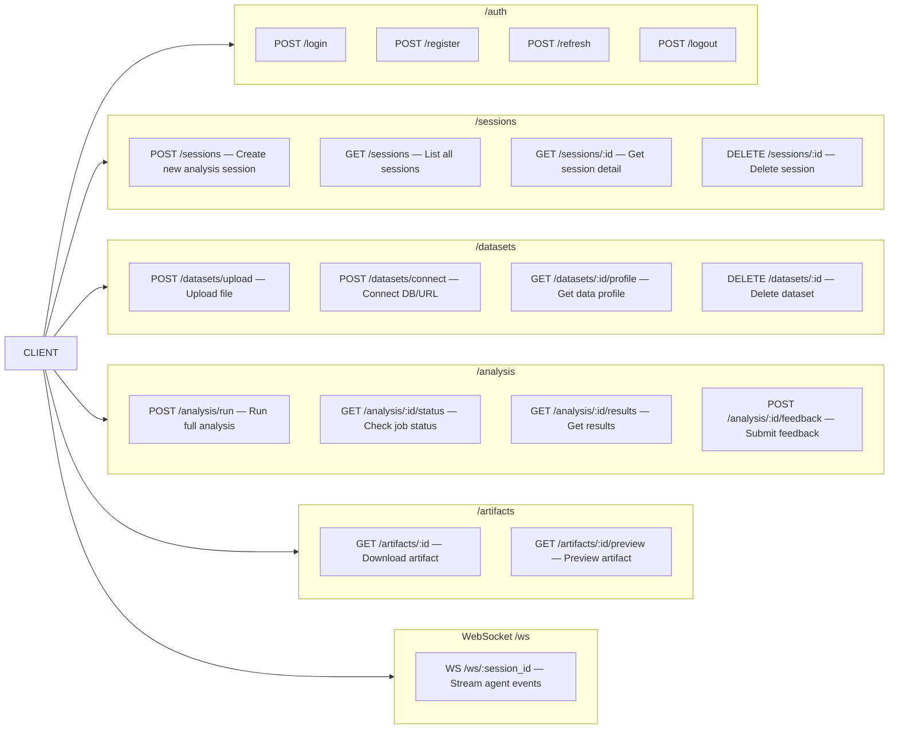

### API Request/Response Flow

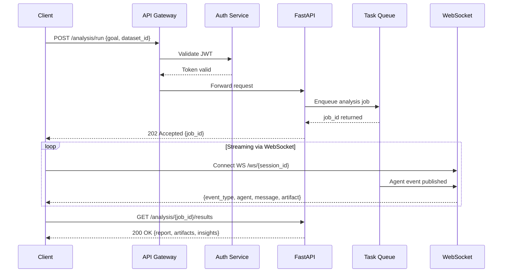

---

## 6. Database Architecture

### Entity-Relationship Diagram

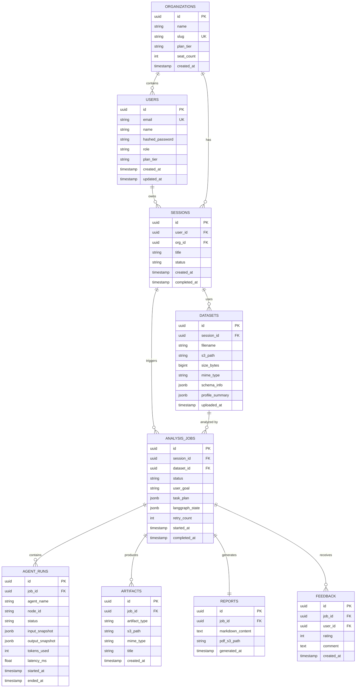

### Vector Database Schema (ChromaDB)

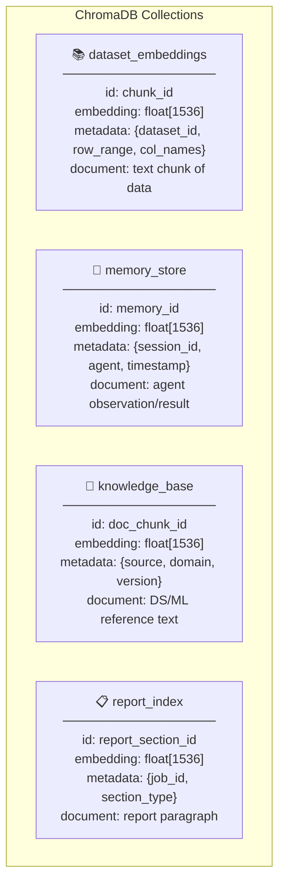

---

## 7. Deployment Architecture

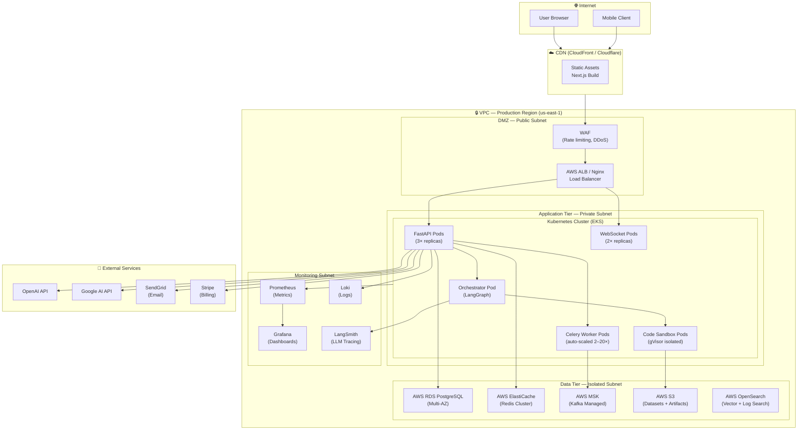

### Kubernetes Resource Overview

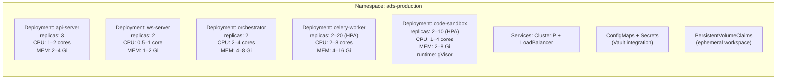

---

## 8. Sequence Diagram

### Full Analysis Workflow

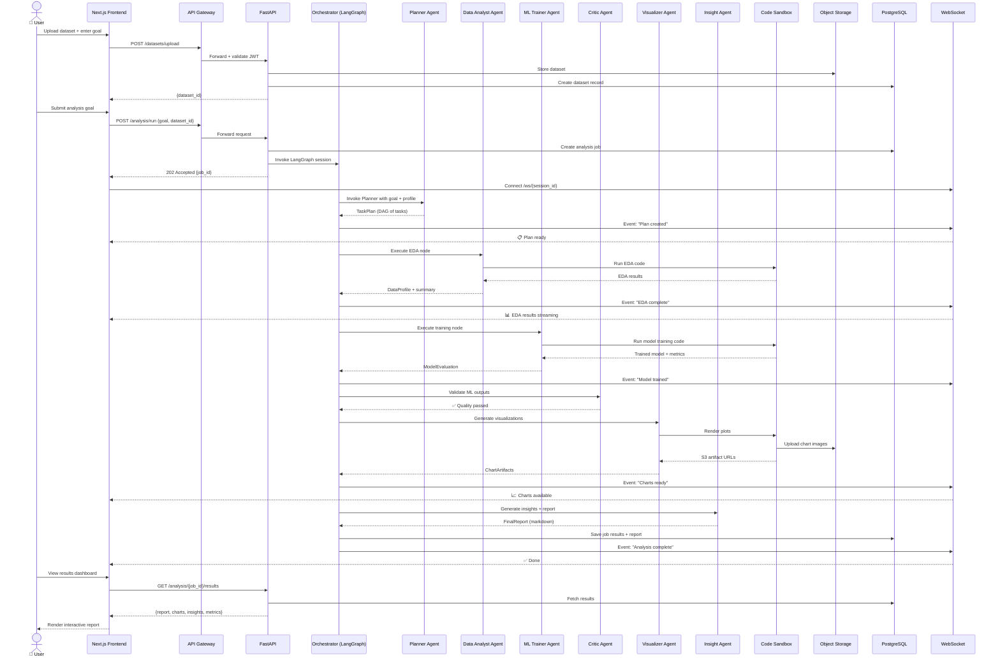

---

## 9. Data Flow Diagram

### Level 0 — Context Diagram

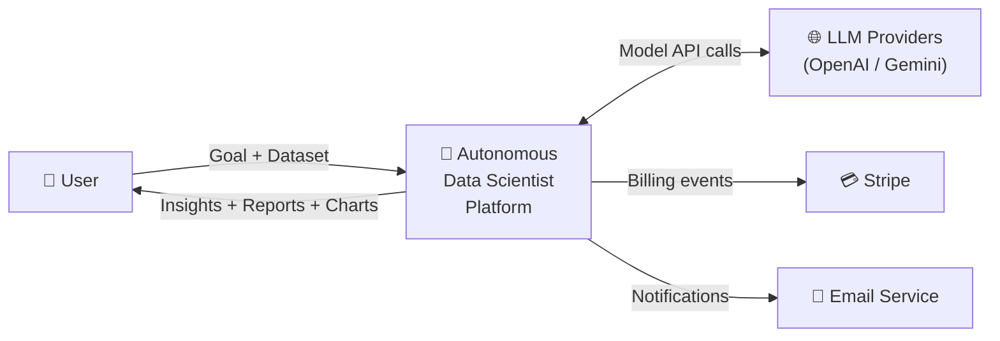

### Level 1 — Main Data Flows

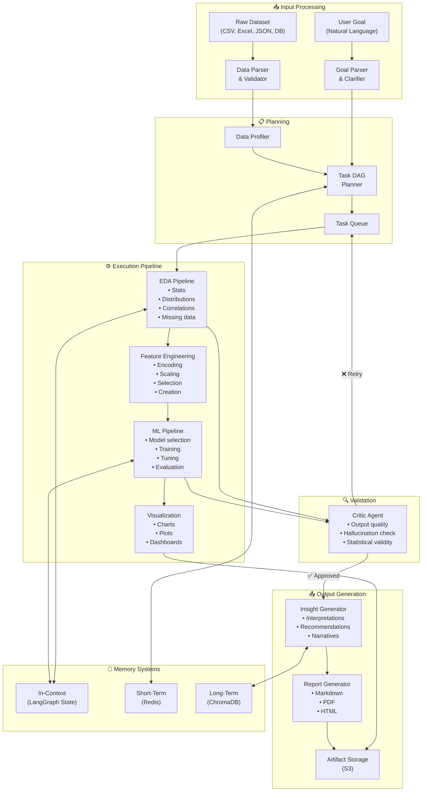

### Level 2 — Agent Internal Data Flow

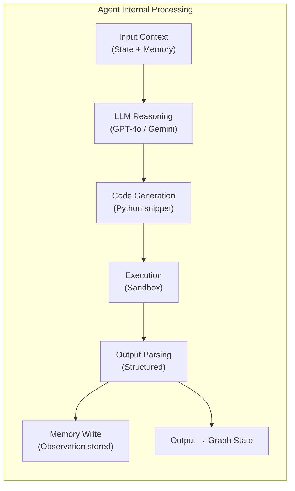

---

## 10. Folder Structure

```
autonomous-data-scientist/
│
├── 📁 apps/
│   ├── 📁 web/                          # Next.js Frontend App
│   │   ├── public/
│   │   ├── src/
│   │   │   ├── app/                     # Next.js App Router
│   │   │   │   ├── (auth)/
│   │   │   │   │   ├── login/
│   │   │   │   │   └── register/
│   │   │   │   ├── (dashboard)/
│   │   │   │   │   ├── sessions/
│   │   │   │   │   ├── analysis/[id]/
│   │   │   │   │   └── datasets/
│   │   │   │   └── layout.tsx
│   │   │   ├── components/
│   │   │   │   ├── chat/
│   │   │   │   ├── dashboard/
│   │   │   │   ├── charts/
│   │   │   │   ├── report/
│   │   │   │   └── shared/
│   │   │   ├── hooks/
│   │   │   ├── lib/
│   │   │   │   ├── api-client.ts
│   │   │   │   └── ws-client.ts
│   │   │   ├── store/                   # Zustand state management
│   │   │   └── types/
│   │   ├── package.json
│   │   └── next.config.ts
│   │
│   └── 📁 cli/                          # Python CLI (agy-ds)
│       ├── ads_cli/
│       │   ├── commands/
│       │   └── main.py
│       └── pyproject.toml
│
├── 📁 services/
│   ├── 📁 api/                          # FastAPI Backend
│   │   ├── ads_api/
│   │   │   ├── main.py                  # App entrypoint
│   │   │   ├── routers/
│   │   │   │   ├── auth.py
│   │   │   │   ├── sessions.py
│   │   │   │   ├── datasets.py
│   │   │   │   ├── analysis.py
│   │   │   │   └── artifacts.py
│   │   │   ├── models/                  # SQLAlchemy models
│   │   │   │   ├── user.py
│   │   │   │   ├── session.py
│   │   │   │   ├── dataset.py
│   │   │   │   ├── analysis_job.py
│   │   │   │   └── artifact.py
│   │   │   ├── schemas/                 # Pydantic schemas
│   │   │   ├── services/
│   │   │   │   ├── auth_service.py
│   │   │   │   ├── dataset_service.py
│   │   │   │   └── analysis_service.py
│   │   │   ├── websocket/
│   │   │   │   └── event_handler.py
│   │   │   ├── middleware/
│   │   │   │   ├── auth_middleware.py
│   │   │   │   └── rate_limiter.py
│   │   │   ├── db/
│   │   │   │   ├── session.py
│   │   │   │   └── migrations/          # Alembic migrations
│   │   │   └── config/
│   │   │       └── settings.py
│   │   ├── tests/
│   │   └── pyproject.toml
│   │
│   └── 📁 worker/                       # Celery Worker Service
│       ├── ads_worker/
│       │   ├── tasks/
│       │   │   ├── analysis_task.py
│       │   │   └── report_task.py
│       │   └── celery_app.py
│       └── pyproject.toml
│
├── 📁 engine/                           # Core Agent Engine (Python)
│   ├── ads_engine/
│   │   ├── __init__.py
│   │   │
│   │   ├── 📁 orchestrator/             # LangGraph orchestration
│   │   │   ├── graph.py                 # StateGraph definition
│   │   │   ├── state.py                 # GraphState schema
│   │   │   ├── nodes.py                 # Node function mappings
│   │   │   ├── edges.py                 # Conditional edge logic
│   │   │   └── runner.py               # Graph execution runner
│   │   │
│   │   ├── 📁 agents/                   # Specialist agents
│   │   │   ├── base_agent.py            # Abstract base agent
│   │   │   ├── planner_agent.py
│   │   │   ├── data_analyst_agent.py
│   │   │   ├── feature_engineer_agent.py
│   │   │   ├── ml_trainer_agent.py
│   │   │   ├── visualizer_agent.py
│   │   │   ├── insight_generator_agent.py
│   │   │   ├── critic_agent.py
│   │   │   ├── code_generator_agent.py
│   │   │   └── research_agent.py
│   │   │
│   │   ├── 📁 tools/                    # Agent tools
│   │   │   ├── registry.py              # Tool registry
│   │   │   ├── python_sandbox.py        # Code execution tool
│   │   │   ├── data_reader.py           # Data I/O tools
│   │   │   ├── db_query.py              # SQL query tool
│   │   │   ├── chart_renderer.py        # Visualization tool
│   │   │   ├── web_search.py            # Research tool
│   │   │   └── file_manager.py          # File system tool
│   │   │
│   │   ├── 📁 memory/                   # Memory systems
│   │   │   ├── memory_manager.py        # Unified memory interface
│   │   │   ├── short_term.py            # Redis-backed STM
│   │   │   ├── long_term.py             # ChromaDB-backed LTM
│   │   │   └── working_memory.py        # In-graph working memory
│   │   │
│   │   ├── 📁 llm/                      # LLM abstraction layer
│   │   │   ├── provider.py              # LLM provider interface
│   │   │   ├── openai_provider.py
│   │   │   ├── gemini_provider.py
│   │   │   └── local_provider.py        # Ollama / vLLM
│   │   │
│   │   ├── 📁 sandbox/                  # Isolated code execution
│   │   │   ├── sandbox_manager.py
│   │   │   ├── local_sandbox.py
│   │   │   └── output_parser.py
│   │   │
│   │   ├── 📁 prompts/                  # Prompt templates
│   │   │   ├── planner_prompts.py
│   │   │   ├── analyst_prompts.py
│   │   │   ├── ml_prompts.py
│   │   │   ├── critic_prompts.py
│   │   │   └── insight_prompts.py
│   │   │
│   │   └── 📁 utils/                    # Shared utilities
│   │       ├── data_profiler.py
│   │       ├── schema_detector.py
│   │       ├── token_counter.py
│   │       └── result_serializer.py
│   │
│   ├── tests/
│   │   ├── unit/
│   │   ├── integration/
│   │   └── e2e/
│   └── pyproject.toml
│
├── 📁 infrastructure/                   # IaC and deployment
│   ├── 📁 k8s/                          # Kubernetes manifests
│   │   ├── namespaces/
│   │   ├── deployments/
│   │   │   ├── api-deployment.yaml
│   │   │   ├── worker-deployment.yaml
│   │   │   ├── orchestrator-deployment.yaml
│   │   │   └── sandbox-deployment.yaml
│   │   ├── services/
│   │   ├── configmaps/
│   │   ├── hpa/                         # Horizontal Pod Autoscalers
│   │   └── ingress/
│   │
│   ├── 📁 terraform/                    # AWS infrastructure
│   │   ├── modules/
│   │   │   ├── vpc/
│   │   │   ├── eks/
│   │   │   ├── rds/
│   │   │   ├── elasticache/
│   │   │   ├── s3/
│   │   │   └── msk/
│   │   ├── environments/
│   │   │   ├── dev/
│   │   │   ├── staging/
│   │   │   └── production/
│   │   └── main.tf
│   │
│   └── 📁 monitoring/                   # Observability configs
│       ├── grafana/
│       │   └── dashboards/
│       ├── prometheus/
│       │   └── prometheus.yml
│       └── loki/
│           └── loki-config.yml
│
├── 📁 packages/                         # Shared Python packages
│   ├── 📁 ads-sdk/                      # Python SDK
│   │   ├── ads_sdk/
│   │   │   ├── client.py
│   │   │   ├── async_client.py
│   │   │   └── models.py
│   │   └── pyproject.toml
│   │
│   └── 📁 ads-types/                    # Shared type definitions
│       ├── ads_types/
│       └── pyproject.toml
│
├── 📁 docs/                             # Documentation
│   ├── architecture/
│   │   └── architecture.md              # This document
│   ├── api/
│   │   └── openapi.yaml
│   ├── guides/
│   └── adr/                             # Architecture Decision Records
│
├── 📁 scripts/                          # Dev and ops scripts
│   ├── setup-dev.sh
│   ├── run-tests.sh
│   └── deploy.sh
│
├── .github/
│   └── workflows/
│       ├── ci.yml
│       ├── cd-staging.yml
│       └── cd-production.yml
│
├── pyproject.toml                       # Monorepo root config
├── package.json                         # JS monorepo root
├── turbo.json                           # Turborepo config
└── README.md
```

---

## Architecture Decision Records (Key Decisions)

| # | Decision | Rationale |
|---|----------|-----------|
| 1 | **LangGraph for orchestration** | Native support for cyclical agent workflows, conditional branching, and state persistence — essential for retry/critic loops |
| 2 | **Celery + Redis for task queue** | Decouples HTTP requests from long-running analysis jobs; supports distributed, autoscaled workers |
| 3 | **gVisor sandbox for code execution** | Provides kernel-level isolation for untrusted Python code without full VM overhead |
| 4 | **ChromaDB for vector memory** | Lightweight, embeddable, no infrastructure overhead vs Pinecone — suitable for both local and cloud deployment |
| 5 | **WebSocket for streaming** | Real-time agent event streaming improves UX for long analyses (vs polling) |
| 6 | **Monorepo structure** | Single repo with Turborepo enables atomic commits, shared types, and unified CI/CD across all services |
| 7 | **LLM provider abstraction** | Supports hot-swapping between OpenAI, Gemini, and local OSS models with zero code change in agents |
| 8 | **PostgreSQL JSONB for state** | Flexible schema for LangGraph state snapshots without full NoSQL complexity |

---

## Non-Functional Architecture Guarantees

| Attribute | Target | Mechanism |
|-----------|--------|-----------|
| **Availability** | 99.9% SLA | Multi-AZ RDS, K8s rolling deployments, ALB health checks |
| **Scalability** | 1000 concurrent sessions | HPA on Celery workers + sandbox pods; Kafka partitioning |
| **Latency (API)** | < 300ms p95 | Redis caching, async FastAPI, connection pooling |
| **Latency (Analysis)** | < 5 min for standard datasets | Parallel agent execution via task DAG |
| **Security** | SOC 2 Type II ready | JWT auth, gVisor sandbox, VPC isolation, secrets via Vault |
| **Observability** | Full trace coverage | LangSmith per-agent tracing + Prometheus/Grafana + Loki |
| **Data Privacy** | GDPR compliant | Data isolation per tenant, deletion APIs, S3 encryption at rest |

---

*Document generated by: Senior Software Architect | Autonomous Data Scientist Platform v1.0*
